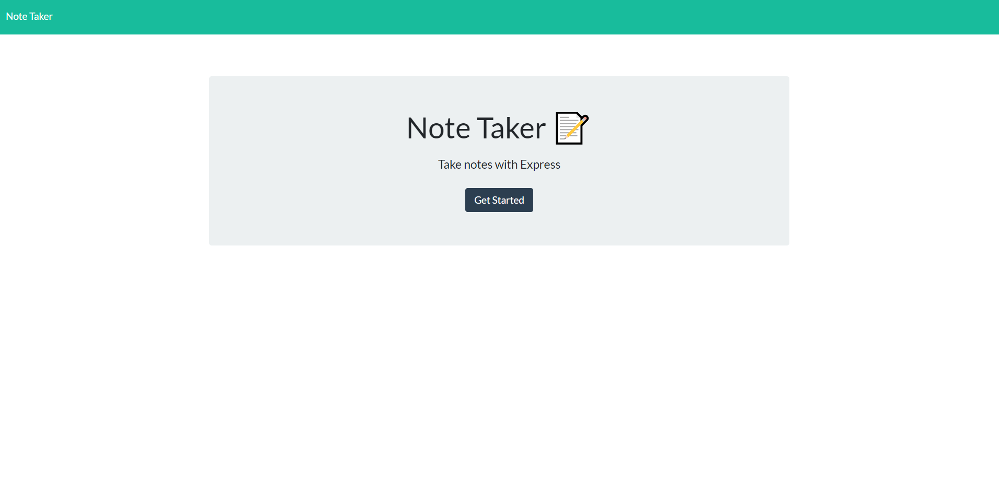
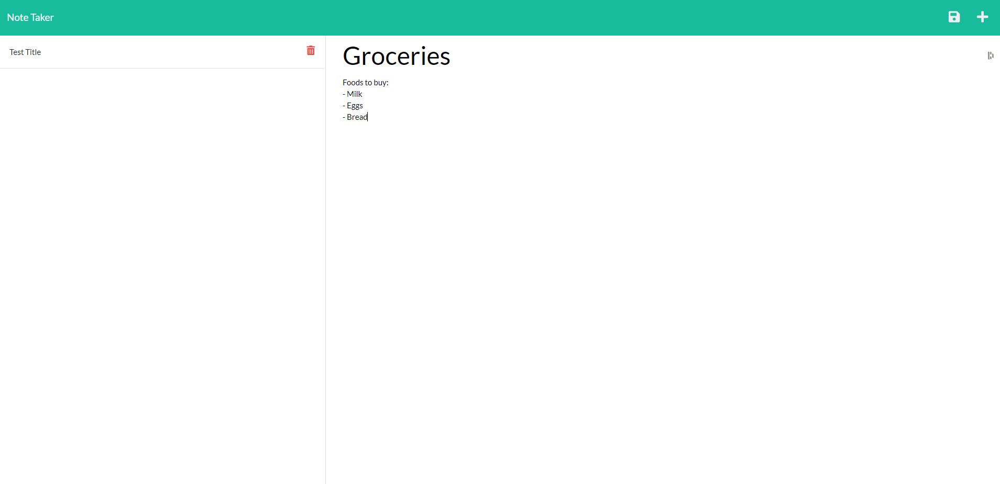
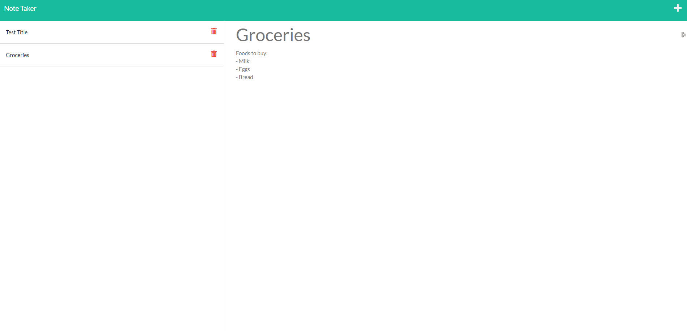

  # Express Note Taker
  
  
  
  
  ## Description
  A Note Taking app designed to run with Node.js Express Server.
  
  ## Table of Contents
  * [Installation](#installation)
  * [Usage](#usage)
  * [Credits](#credits)
  * [License](#license)
  ## Installation
  npm install
  
  ## Usage 
  Run the app, or visit the deployed link, and use the app to take detailed notes at will.
  
  Deployed Link:  https://loveday-note-taker.herokuapp.com/
  ## Credits
  Jack Loveday
  ## License
  This project is [MIT](https://choosealicense.com/licenses/mit/) licensed. 
  Copyright © 2021 [JACK LOVEDAY](https://github.com/jackloveday-git)

  
  ## Tests
  N/A
  ## Questions
  Contact the author with any questions! 
  Github link: [jackloveday-git](https://github.com/jackloveday-git) Email: jack.loveday95@gmail.com
  